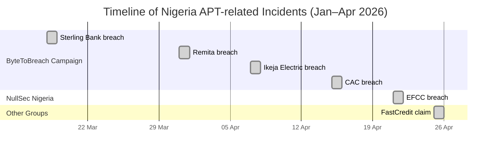
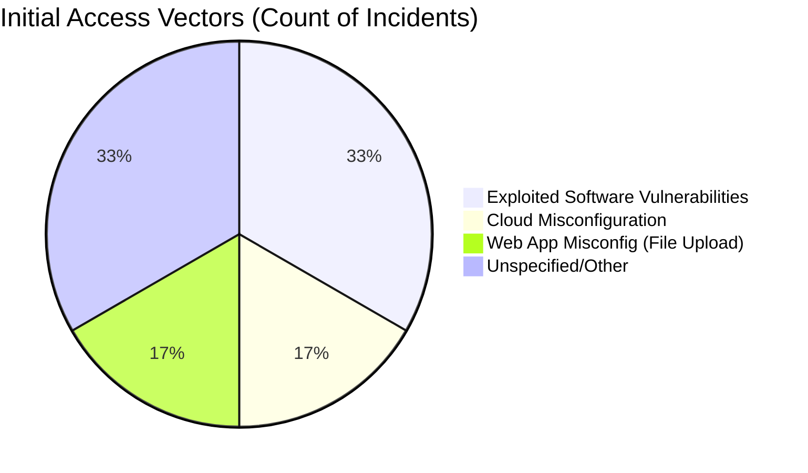

# Executive Summary  
Nigeria’s institutions faced a **wave of coordinated APT-style breaches in early 2026**. A cybercriminal known as **ByteToBreach** (sometimes called “Byte”) claimed responsibility for multiple high-impact hacks: a **Sterling Bank** breach (Mar 18) via an unpatched RCE vulnerability, a **Remita** data leak (Mar 31) via an open AWS S3 bucket, and a **Corporate Affairs Commission (CAC)** hack (Apr 15) exfiltrating ~25 million company records【80†L409-L416】【23†L157-L163】. Another incident involved **Ikeja Electric** (Apr 2026), where ByteToBreach exploited a web portal upload flaw to deploy a Sliver C2 implant and later spread ransomware【78†L179-L187】【78†L198-L203】. Separately, a group dubbed **“NullSec Nigeria”** (alias “ki4t”) leaked **EFCC** law-enforcement data (Apr 21), exposing names, phone numbers, code names and password hashes【75†L141-L145】【51†L113-L122】. The common thread was exploitation of technical flaws and misconfigurations rather than broad phishing: ByteToBreach even **claims to use “no phishing, no SIM-swapping, no stolen infostealer credentials”**【82†L163-L168】. These attacks underscore systemic weaknesses (legacy systems, weak configs, no MFA) in Nigerian critical sectors. In response, regulators (NITDA/NDPC) have launched investigations and **advised immediate mitigations** – e.g. enforce multifactor authentication, patch vulnerabilities, encrypt data, and secure cloud storage【24†L193-L202】【75†L169-L177】.  

| Date       | Target/Organization      | Sector        | Threat Actor    | Initial Access Method    | Key MITRE TTPs (Examples)              | Indicators (IOCs)                       | Confidence      |
|------------|--------------------------|---------------|-----------------|--------------------------|----------------------------------------|-----------------------------------------|-----------------|
| 2026-03-18 | Sterling Bank (Pilot)    | Banking       | ByteToBreach    | CVE-2025-55182 RCE on React portal【80†L409-L416】 | T1190 (Public-facing Exploit), T1059 (Shell), T1573.002 (MTLS C2)【80†L409-L416】【84†L139-L142】 | Sliver C2 at 152.32.180.243:443【84†L139-L142】 (TLS beacon) | Confirmed (actor proof posts) |
| 2026-03-31 | Remita Payment Platform  | Fintech/Paymnt| ByteToBreach    | Compromised AWS keys (misconfigured S3)【43†L297-L306】 | T1560.001 (S3 Data), T1537.003 (Transfer via Cloud API)【43†L297-L306】 | — (no external C2; actor-owned repo)    | Confirmed (actor dump)     |
| 2026-04-07 | Ikeja Electric (SWIMS)   | Utilities     | ByteToBreach    | Unvalidated file upload (webshell)【78†L179-L187】 | T1189 (Drive-by/File Upload), T1059 (Webshell), T1078 (Valid Accs via SMTP creds)【78†L179-L187】【78†L198-L203】 | — (compromised Ikeja network)          | Claimed (detailed report) |
| 2026-04-15 | Corporate Affairs Comm.  | Government    | ByteToBreach    | Unknown (likely exploit or stolen creds) | T1190 (Exploit), T1083 (Access admin objects), T1567 (Exfil via backup) | — (claimed leak of 25M docs)           | Claimed (screenshots)      |
| 2026-04-21 | EFCC (National LEA)      | Government    | NullSec Nigeria | Unknown (data scraping)   | T1005 (Data from repos), T1530 (Data from Cloud)  | — (forum dump by “ki4t”)               | Claimed (published leak)   |
| 2026-04-25 | FastCredit Finance (claim) | Finance    | “iProfessor”    | Unknown (dark-web claim) | — (undetermined)                       | — (posts of 870GB data)                | Unverified claim           |

*Table: Summary of 2026 Nigeria APT-related incidents. MITRE TTPs are illustrative. “Confirmed” incidents have third-party technical analysis (or regulator action); “Claimed” are actor claims on forums; “Unverified” remain speculative.*  

## Attack Vectors & Initial Access Methods  
- **Exploited Vulnerabilities:** ByteToBreach used technical exploits for entry. For example, the Sterling Bank portal (React framework) had an unpatched RCE (CVE-2025-55182)【80†L409-L416】. In Ikeja Electric, a client-side file-type check was bypassed, allowing a PHP webshell upload【78†L179-L187】. These feats correspond to MITRE *T1190 (Exploit Public-Facing App)* and *T1189 (Drive-by/File Upload)*.  
- **Cloud Misconfiguration:** The Remita attack exploited an AWS S3 misconfiguration. Using credentials extracted from source code, the actor downloaded a 3 TB bucket (657k documents, 588 GB of KYC files)【43†L297-L306】. This maps to *T1560.001 (Cloud Storage)* and *T1537.003 (Transfer Data to Cloud Account)*.  
- **Valid Accounts:** After initial breaches, attackers harvested credentials. In Ikeja, they found SMTP service-account creds in plaintext configs, using them to authenticate to Active Directory (MITRE *T1078*, *T1552*)【78†L198-L203】. They then escalated privileges.  
- **Unknown/Other:** The exact entry point at CAC and EFCC isn’t specified. No reported phishing emails or malware campaigns were tied to these breaches. ByteToBreach **explicitly denies using phishing or stolen infostealer credentials**【82†L163-L168】, so initial access was likely via system flaws or insider access. (Notably, ByteToBreach demonstrated he could **spoof Central Bank emails** using a compromised signing key【78†L125-L132】, but said this was a prank, not an initial vector.)  

## Phishing & Social Engineering  
Despite sensational reporting, **no confirmed phishing campaigns** are tied to these incidents. ByteToBreach claims never to use phishing, SIM-swapping or stolen credential feeds【82†L163-L168】. (For instance, he mocked the idea of offering “legitimate pentesting services” on his satirical site.) The only noted social-engineering stunt was a **spoofed CBN email**: an email cryptographically signed as if from Nigeria’s central bank arrived at a reporter’s inbox, which ByteToBreach admitted was a publicity “prank”【78†L125-L132】【78†L128-L136】. There is no evidence of active spear-phishing lures, fake sender domains, or widespread email blasts in these cases. Likewise, NullSec Nigeria’s EFCC leak was published directly on a forum by “ki4t” with no apparent phishing delivery phase【75†L141-L145】. 

## Domain & Infrastructure Indicators  
None of the reports cite malicious domain registrations (e.g. attacker-controlled domains) beyond ByteToBreach’s own sites. The actor maintains a public WordPress “Pentesting Ltd.” site (**bytetobreach.com**) for propaganda【72†L190-L199】. Key infrastructure IOCs include: 
- **IP addresses:** Sliver C2 beaconing to **152.32.180.243:443** (mutual-TLS channel)【84†L139-L142】, and the actor’s VPS at **206.217.216.145** (seen in C2 communications)【40†L30-L34】. Blocking these at the firewall is recommended【80†L488-L491】.  
- **TLS/Certificates:** The Sliver C2 used a custom TLS certificate and 60-sec beacon interval to blend with normal traffic【84†L139-L142】【83†L1-L4】. Network monitoring should flag unusual MTLS sessions or rare SSL certs to external IPs.  
- **Victim network:** ByteToBreach’s compromise of Sterling pivoted into Remita via **trusted network links**【45†L415-L424】. This highlights any pre-existing network allow-lists (e.g. Sterling→Remita). No specific malicious registrars or WHOIS patterns were reported; the attackers mostly used compromised legitimate accounts and cloud services.  

【73†embed_image】 *Figure: ByteToBreach’s public “Pentesting Ltd.” WordPress site (bytetobreach.com) boasts “More resilient, more devious” in its header【72†L190-L199】. This satirical page lists victim logos and contact info for the attacker.*  

## Malware Tools & Command-and-Control  
The attackers leveraged known tools:  
- **Sliver (open-source C2):** Deployed via webshell to maintain MTLS-encrypted backdoors【78†L198-L203】【84†L139-L142】. The Sliver implant checked in ~every 60 seconds on port 443【84†L139-L142】【83†L1-L4】.  
- **Metasploit:** Used (by ByteToBreach) to exploit CVE-2025-55182 on Sterling’s portal【41†L125-L133】.  
- **BloodHound:** To map Active Directory relationships after gaining a foothold【78†L247-L251】.  
- **Hashcat:** For offline cracking of the compromised domain-admin NTLM hash【78†L224-L232】. (It was reportedly cracked in minutes.)  
- **Custom malware/Ransomware:** ByteToBreach later deployed ransomware on ~50 hosts at Ikeja Electric【78†L261-L269】. The ransomware name is unspecified, but this corresponds to ATT&CK *T1486 (Data Encryption)*.  

By contrast, no bespoke malware families (e.g. infostealers) were cited in these events. The EFCC data dump contained static credential hashes, suggesting no malware was installed there.  

## Lateral Movement & Persistence  
After initial compromise, ByteToBreach employed classic enterprise-attack techniques:  
- **Credential harvesting & reuse:** In Ikeja Electric, the webshell revealed SMTP service-account credentials, which granted AD domain access【78†L198-L203】. He also found a **Backup-Operators** account password in Veeam configs, allowing him to extract the full AD database (SAM) and recover the domain-admin hash【78†L224-L232】. This matches MITRE *T1087 (Account Discovery)* and *T1552 (Unsecured Credentials)* from Sterling’s breach【80†L414-L417】.  
- **Privilege escalation:** Cracking the simple domain-admin hash immediately gave full control【78†L224-L232】. The actor also exploited a known vCenter vulnerability to gain system-level control over all virtual machines【78†L237-L244】.  
- **Network pivoting:** The Sliver implant ran inside containers and enumerated the whole Kubernetes environment【84†L154-L163】, yielding dozens of internal service endpoints. In Sterling/Remita, the attacker leveraged Sterling’s trust relationship (and its own compromised network) to reach Remita’s systems from “inside”【45†L417-L426】. This exemplifies MITRE *T1534 (Internal Spearphishing; Sterling→Affiliated Partner)*.  
- **Persistence:** Sliver provided persistent C2. No additional custom rootkits were needed, but the use of a legitimate Kubernetes MTLS channel (concealed as normal HTTPS) was a key evasion tactic【84†L144-L151】.  

## Data Collection & Exfiltration  
The breaches centered on large-scale data theft, followed by posting or selling:  
- **Sterling Bank:** via Sliver (ATT&CK *T1041*), the attacker exfiltrated BVNs, NINs, salary and credit data【10†L126-L135】【43†L193-L202】. WSL notes data was sent over the encrypted C2 channel【80†L418-L420】.  
- **Remita:** Stolen AWS credentials allowed direct download of databases and files. The actor exfiltrated ~588 GB of KYC documents and multiple databases (user data, logs) and publicly dumped them. Over 35,000 password hashes were leaked from these dumps【43†L297-L306】. Most sensationally, a directory of **Hardware Security Module (HSM) keys** for 46 Nigerian banks was included【45†L326-L334】, threatening the entire interbank payment system if real.  
- **Ikeja Electric:** The attacker exfiltrated employee and customer databases, source code, and a complete snapshot of Active Directory (including cracked passwords) before deploying ransomware【78†L261-L269】.  
- **CAC:** ByteToBreach claimed ~750 GB (25M records) of corporate registry files were stolen. (One screenshot labeled “GOV_BETRAYAL” spanned “Breakthrough” to “Exfiltration” stages【54†L214-L223】.) About 15M substantive records (director IDs, ownership) were in the haul.  
- **EFCC:** “NullSec” simply dumped data on a forum. The leak included operatives’ names, mobile numbers, code names and hashed passwords【51†L113-L122】. If those hashes were cracked, it could expose bank accounts or internal systems.  

## Correlation and Overlap  
Aside from timing, **ByteToBreach** and **NullSec Nigeria** appear unrelated. ByteToBreach is a single, data-extortion operator (often selling breached datasets on underground forums)【80†L408-L416】【43†L276-L285】. NullSec Nigeria (ki4t) behaves like a hacktivist, dumping law-enforcement data presumably for notoriety. No shared infrastructure or actors have been publicly identified. Their TTPs differ: Byte used complex exploits and lateral moves, whereas NullSec’s hack (EFCC) details are sparse – likely a simple web/database compromise. The only tenuous link is context: both groups surfaced in media concurrently, highlighting Nigeria’s broad cybersecurity crisis【75†L141-L145】【82†L163-L168】.  

## Recommended Mitigations and Detections  
Authorities (NDPC/NITDA) have issued wide-ranging advice. Key measures include: 

- **Patch and patch management:** Fix all known vulnerabilities, especially Internet-facing ones. (Sterling failed to patch CVE-2025-55182【10†L126-L135】.) Enforce vulnerability scanning and SLAs for remediation【80†L500-L508】.  
- **Secure cloud/storage:** Audit AWS S3 buckets and databases. Ensure buckets (like Remita’s) are not publicly accessible. Use IAM roles and least privilege for service accounts【43†L297-L306】.  
- **MFA and access controls:** Enforce multifactor authentication on all privileged accounts, including third-party APIs【75†L169-L177】. Eliminate hardcoded passwords in apps (rotate any found secrets)【80†L482-L491】. Apply rate-limits and scope checks on admin APIs (Sterling’s broken API was abused for data【80†L436-L445】).  
- **Network defenses:** Implement strict egress filtering and TLS inspection. For example, block the known C2 IPs (152.32.180.243, 206.217.216.145) and monitor for abnormal MTLS sessions【80†L488-L492】【84†L139-L142】. Deploy container runtime monitors (Falco/Tetragon) to catch stealthy C2 within Kubernetes【80†L498-L502】.  
- **Web app hygiene:** Add server-side input validation (don’t trust client checks). Ikeja’s SWIMS portal failed to re-verify file types【78†L179-L187】; implement web application firewalls and antivirus/EDR to detect webshells.  
- **Backup and recovery:** Maintain offline backups of critical data and test restore procedures (the lack of backups meant Ikeja’s operations were disrupted). Use immutable or versioned backups so ransomware cannot encrypt them.  
- **Detection signatures:** The Sliver C2 has a distinctive TLS fingerprint and beacon rate【84†L139-L142】. IDS rules can flag MTLS on port 443 to unknown servers. Hunt for known exploit attempts (signatures for CVE-2025-55182). Look for unusual AD queries or decryption API calls without authentication (Sterling’s decryption oracle【84†L255-L263】).  
- **Organizational measures:** Appoint Data Protection Officers and staff cybersecurity training【24†L193-L202】. Ensure timely incident reporting to NDPC/CBN as required. Conduct third-party security reviews (NDPC warns of all MDAs under NDPA)【24†L193-L202】【75†L169-L177】.  

By applying these mitigations (patching, MFA, logging, segmentation) and hunting for the IOCs above, organizations can disrupt the tactics described. In particular, detecting Sliver’s enclave (MTLS) and blocking its known IPs should cut off ByteToBreach’s C2.【84†L139-L142】【80†L488-L492】 Organizations should also monitor underground forums for ByteToBreach’s leak announcements as early warning. 

**Sources:** Technical analyses from Web Security Lab, Security Intelligence (IBM X-Force), and business reports【10†L126-L135】【78†L179-L187】【80†L409-L416】【75†L141-L145】, as well as statements by NDPC/NITDA【24†L193-L202】【75†L169-L177】. All details above are drawn from these vendor/CERT reports and trusted news sources. 